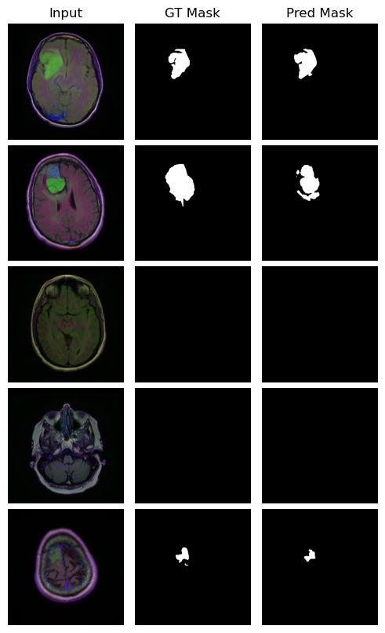

# Brain MRI Segmentation with Residual UNet

This repository contains a **Residual UNet model** for brain tumor segmentation on MRI images (LGG dataset). The project is implemented in **PyTorch** and includes data augmentation, Dice & Jaccard metrics, and visualization utilities.


##  Features

- Residual UNet architecture for segmentation.
- Data augmentation (rotation, flip, affine transformations).
- Dice and Jaccard score metrics.
- Training, validation, and testing pipeline.
- Visualization of predictions and loss curves.
- Ready-to-run scripts with configurable arguments.


## Project Structure

````
brain-mri-segmentation/
│── data.py             # Dataset loading, split, dataloaders
│── model.py            # Residual UNet model definition
│── train.py            # Training & evaluation loops
│── utils.py            # Metrics, plotting, reproducibility
│── main.py             # Entry point script
└── README.md
````

## Setup

1. Clone the repository:

    ```bash
    git clone https://github.com/m4hyarm/brain-mri-segmentation.git
    cd brain-mri-segmentation
    ```

2. Download **LGG MRI Segmentation Dataset** by [Mateusz Buda](https://www.kaggle.com/datasets/mateuszbuda/lgg-mri-segmentation).

    You can download it using **Kaggle API**

    ```bash
    # Install kagglehub if not installed
    pip install kagglehub

    import kagglehub

    # Download latest version
    path = kagglehub.dataset_download("mateuszbuda/lgg-mri-segmentation")

    print("Path to dataset files:", path)
    ````
    ```

    > Make sure the extracted folder path is used as `--data_dir` in `main.py`.

## Training

Run the training script with default arguments:

```bash
python main.py --data_dir ./data/kaggle_3m --epochs 40 --batch_size 16
```

- Optional arguments:

    ```
    --data_dir       Path to dataset
    --epochs         Number of training epochs
    --batch_size     Batch size
    --lr             Learning rate
    --weight_decay   Weight decay for Adam optimizer
    --img_size       Resize images to this size (default 256)
    --seed           Random seed for reproducibility
    ```


## Evaluation & Visualization

After training, the script automatically:

* Prints **test loss, Dice score, and Jaccard score**.
* Plots **training/validation loss curves**.
* Shows **sample predictions** alongside input images and ground truth masks.

<p align="center">
    
</p>

<p align="center">
    <em>Above: Input MRI, ground truth mask, and model prediction.</em>
</p>

## References

* [LGG MRI Segmentation Dataset](https://www.kaggle.com/datasets/mateuszbuda/lgg-mri-segmentation)
* [UNet PyTorch Implementation](https://pytorch.org/hub/mateuszbuda_brain-segmentation-pytorch_unet)
